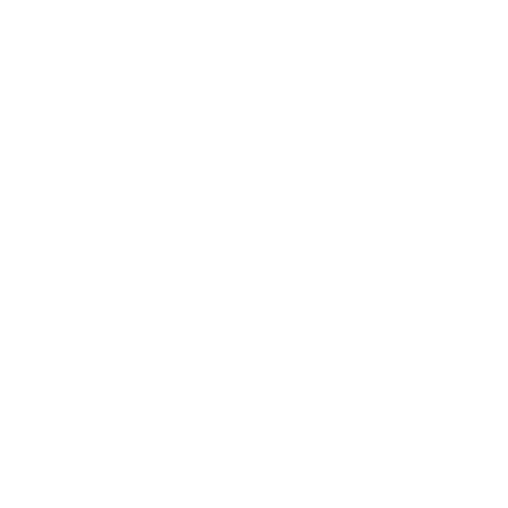

# Nxify your Angular App

How Nx Cloud Makes Angular Development and Deployment Faster

  

 Katerina Skroumpelou
  

  

    Product Advocate at Nx
  

  

  

   
  

   
+

 

    
  

   
+

 

   
  

    
=

  
❤️⚡️

 
 

### slides: ngday24-nx.netlify.app
