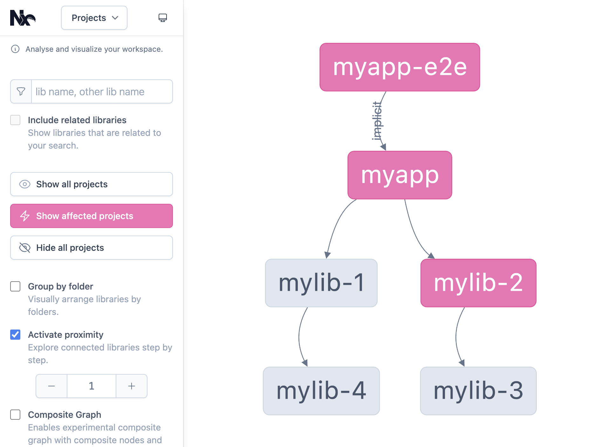

# Run Only Affected Tasks

  

    

      Optimize builds by running only tasks affected by a PR.
    

    

      <h3 class="font-bold text-lg mb-4">
        <i class="i-mdi-graph mr-2" />
        Smart Task Execution
      </h3>
      <ul class="list-disc ml-4 space-y-2">
        <li>Analyzes dependency graph</li>
        <li>Identifies affected projects</li>
        <li>Skips unnecessary builds</li>
      </ul>
    

  

  

    

      
Dependency Graph Example

      

      
      

      

        Blue nodes indicate affected projects
      

    

  

  @psybercity - @NxDevTools - 🦋 @psyber.city - 🦋 @nx.dev - Katerina Skroumpelou - AngularDay2024

