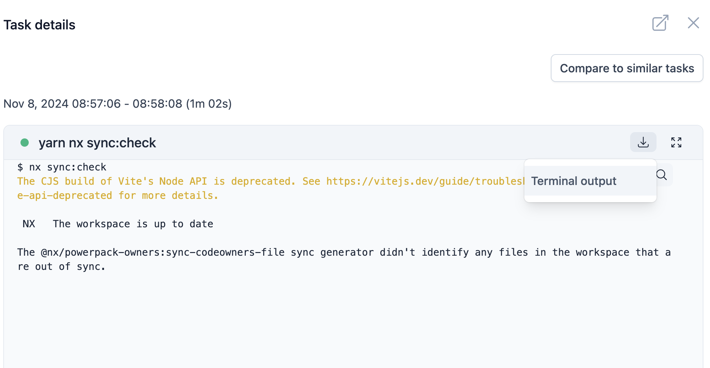

# New features

  

  nxCloudId for better access control
  

  

    <h3 class="font-bold text-lg mb-4">
      <i class="i-mdi-shield-check mr-2" />
      Access Control
    </h3>
    

      Access is restricted to members of your organization for security.
    

  

::right::

  

    

      
Download task artifacts

      

        
      

      

        Download logs from current task.
      

    

  

  

  @psybercity - @NxDevTools - 🦋 @psyber.city - 🦋 @nx.dev - Katerina Skroumpelou - AngularDay2024

