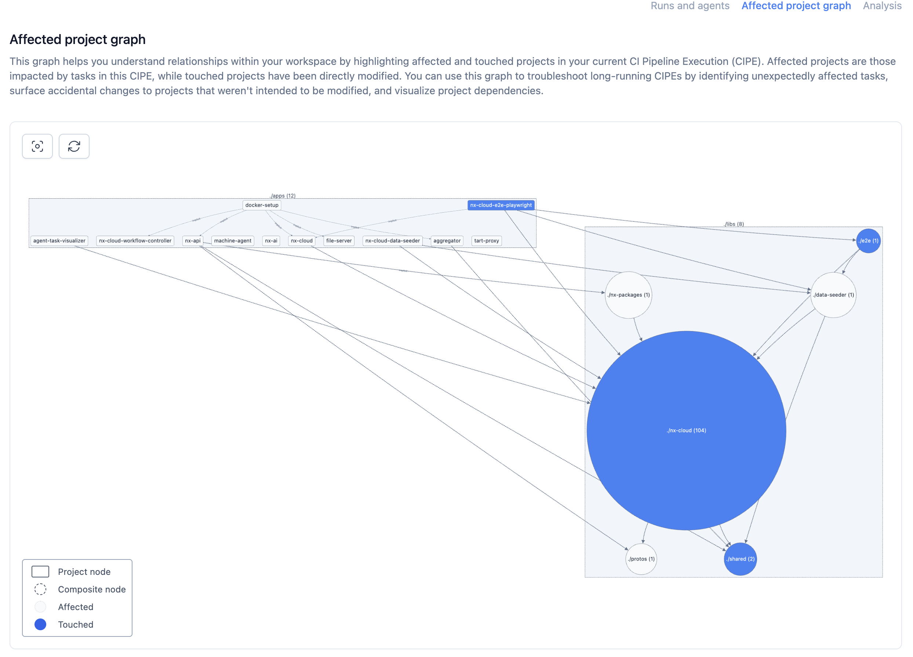

# CIPE Affected Project Graph

  

    Helps visualize project relationships and troubleshoot CI issues.
  

  

    

      <h3 class="font-bold text-lg mb-4">
        <i class="i-mdi-graph-outline mr-2" />
        Project Dependencies
      </h3>
      <ul class="list-disc ml-4 space-y-2">
        <li>Visualize project relationships</li>
        <li>Identify affected projects</li>
        <li>Troubleshoot CI issues</li>
      </ul>
    

  

    

      
Affected Project Graph

      

        
      

      

        Blue nodes indicate affected projects
      

    

  

  

