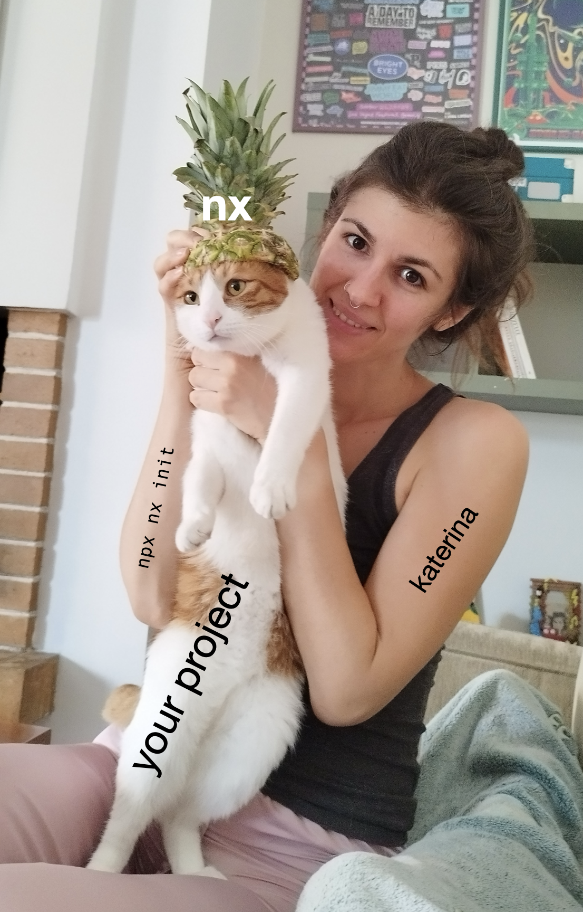

# So get started with Nx Cloud right MEOW! 🐱

  

       <a href="https://nx.dev" target="_blank" class="flex items-center gap-2">
 📚 nx.dev
  </a>
  

  
  

       <a href="https://monorepo.tools" target="_blank" class="flex items-center gap-2">
    🔧 monorepo.tools
  </a>
  

  
  

       <a href="https://bsky.app/profile/nx.dev" target="_blank" class="flex items-center gap-2">
    🦋 @nx.dev
  </a>
  

  
  

       <a href="https://x.com/NxDevTools" target="_blank" class="flex items-center gap-2">
    🐦  @NxDevTools
  </a>
  

  
  

       <a href="https://psyber.city" target="_blank" class="flex items-center gap-2">
    🐦 psyber.city
  </a>
  

  
  

     <a href="https://ngday24-nx.netlify.app" target="_blank" class="flex items-center gap-2">
    Slides 📽️: ngday24-nx.netlify.app
  </a>
  

  
   

     <a href="https://github.com/mandarini/demo-ng-day-24" target="_blank" class="flex items-center gap-2">
    Demo 🦾: github.com/mandarini/demo-ng-day-24
  </a>
  

::right::

  

 
  

